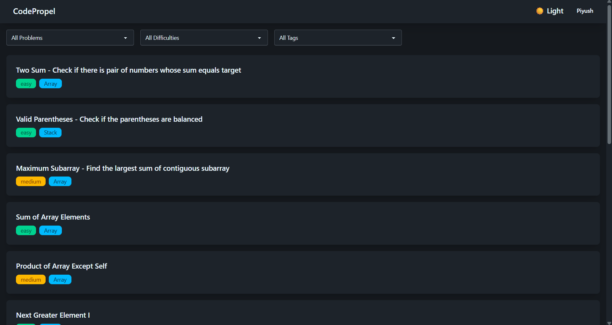
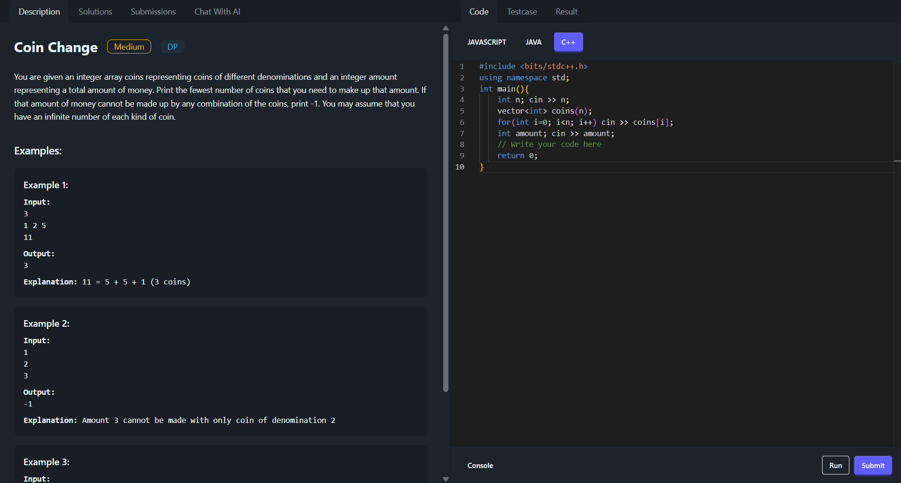
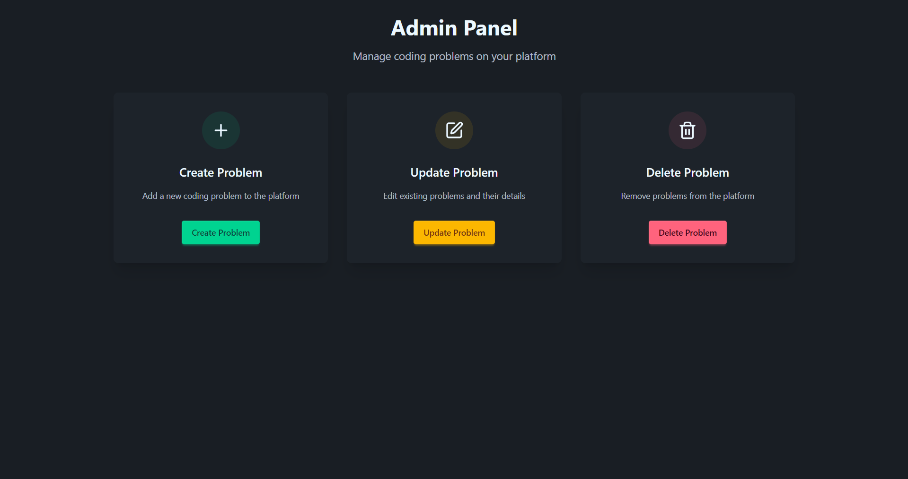
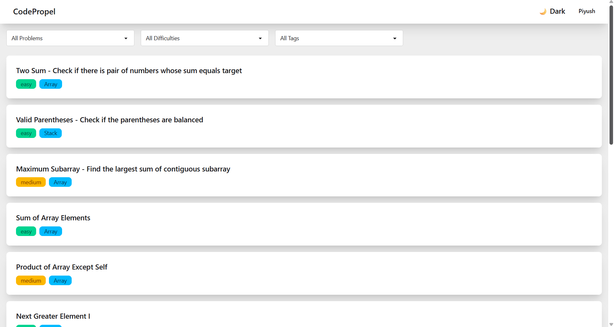
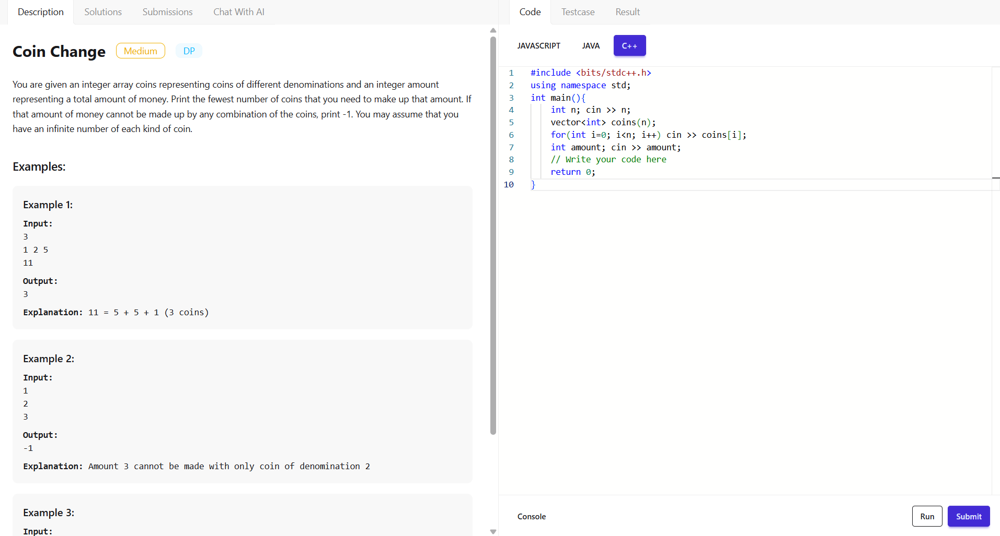

# CodePropel – Coding Practice Platform

> A full-stack coding platform built with MERN, enabling users to practice coding, run solutions online, and chat with AI for assistance.

**CodePropel** is a full-stack **MERN-based coding practice platform** where users can solve programming problems, test their solutions, and interact with an AI assistant for guidance. It provides a clean, interactive environment for coding, learning, and practicing problems in **C++, JavaScript, and Java** — with both **light and dark themes** for an enhanced user experience.

---

## Live Demo

> 🔗 https://code-propel-frontend.vercel.app/

---
## Highlights

* Real-time code execution for multiple languages
* AI-powered problem-solving assistance
* Admin panel with role-based access and problem management
* Modern, themeable UI with Monaco Editor

## Screenshots

### Home Page

### Problem Page

### Admin Panel

---

## Features

### **User Features**

* **Authentication**
  Secure user authentication with **JWT**. New users must **sign up** before accessing the platform.

* **Home Page**
  Displays a list of problems as cards containing:
  * Problem Title  
  * Difficulty Level  
  * Tag / Topic

* **Problem Page**
  When a user selects a problem, they are taken to a split-view interface with:

  #### 🔹 Left Panel (Tabs)
  * **Description Tab** – Displays the problem title, description, and visible test cases (examples).  
  * **Solution Tab** – Shows the official solutions in **C++**, **JavaScript**, and **Java**.  
  * **Submissions Tab** – Displays the user’s submission history with code for each attempt.  
  * **Chat with AI Tab** – Integrated **Gemini AI** chat system for problem-solving assistance.  

  #### 🔹 Right Panel (Tabs & Actions)
  * **Language Selector Buttons** – Choose from C++, JS, or Java.  
  * **Code Tab** – Monaco Editor with initial template code based on selected language.  
  * **Testcase Tab** – Displays outcomes when the user **runs** code on visible test cases.  
  * **Result Tab** – Displays final outcomes when the user **submits** code on hidden test cases.  

  #### Buttons
  * **Run** – Executes code against visible test cases via **Judge0 API**.  
  * **Submit** – Executes code against hidden test cases to validate correctness via **Judge0 API**.  

---

### **Admin Features**

Admins have all user capabilities plus additional administrative tools:
* Create new problems  
* Update existing problems  
* Delete problems  
All accessible through a dedicated **Admin Panel**.

---

### **Themes**

* Fully supports **Light** ☀️ and **Dark** 🌙 modes for comfortable coding anytime.

### Home Page Light

### Problem Page Light

---

##  Tech Stack

| Layer                       | Technology                                      |
| --------------------------- | ----------------------------------------------- |
| **Frontend**                | React.js, Tailwind CSS, Daisy UI, Redux Toolkit |
| **Backend**                 | Node.js, Express.js                             |
| **Database**                | MongoDB                                         |
| **Caching / Rate Limiting** | Redis                                           |
| **Authentication**          | JWT (JSON Web Token)                            |
| **Code Execution**          | Judge0 API                                      |
| **AI Chat Assistant**       | Gemini API                                      |
| **Editor**                  | Monaco Editor                                   |

---

## Authentication & Security

* **JWT-based authentication** ensures secure and stateless access for all users.  
* **Role-based authorization** restricts platform modifications — only **admins** can create, update, or delete problems, while normal users can only solve them.  
* **Redis integration** provides:  
  - Rate limiting to prevent abuse of API endpoints.  
  - Token blacklisting on logout to block further misuse.

